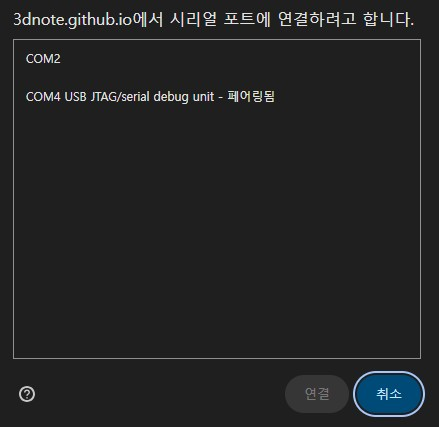
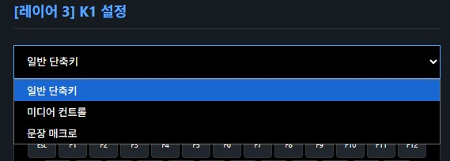

# MacroKeypad Web UI 사용 설명서

이 문서는 MacroKeypad의 웹 인터페이스를 사용하여 기기를 설정하고 관리하는 방법을 안내합니다. 
웹 UI는 직관적이고 사용하기 쉬운 인터페이스를 제공하며, 브라우저를 통해 MacroKeypad와 상호작용할 수 있습니다.

---

## 1. 준비물

MacroKeypad를 사용하기 위해 필요한 준비물은 다음과 같습니다:

1. **MacroKeypad 기기**
2. **USB 데이터 케이블** (충전 전용 케이블은 사용할 수 없습니다.)
3. **Chrome 또는 Edge 브라우저** (최신 버전 권장)
4. **인터넷 연결** (웹 UI 접속용)

---

## 2. 웹 UI 접속 방법

1. Chrome 또는 Edge 브라우저를 엽니다.
2. [MacroKeypad Web UI](https://3dnote.github.io/macrokeypad)에 접속합니다.
3. 웹 UI가 로드되면 다음과 같은 화면이 나타납니다:
   - 상단에 **기기 연결** 버튼이 보입니다.
   - 화면 중앙에는 키 매핑 인터페이스가 표시됩니다.

---

## 3. MacroKeypad 연결하기

1. MacroKeypad를 USB 케이블로 PC에 연결합니다.
2. 웹 UI에서 **기기 연결** 버튼을 클릭합니다.
3. 시리얼 포트를 선택하라는 팝업창이 나타납니다:
   - 여러 포트가 표시될 수 있습니다. 
   - 목록에서 **"페어링됨"** 표시가 있는 포트를 선택하세요. 예: `COM4 USB JTAG/serial debug unit - 페어링됨`.
   - **"페어링됨"** 표시가 없는 포트는 디버그 장치일 가능성이 높으니 선택하지 마세요.
4. 올바른 포트를 선택한 후 **연결** 버튼을 클릭합니다.
5. 연결이 성공하면 화면 상단에 **기기 연결됨** 표시가 나타납니다.

---

## 4. 주요 기능 사용법

### 4.1 키 매핑 설정

1. **레이어 선택**: 화면 상단의 레이어 탭에서 편집할 레이어를 선택합니다.
2. **키 선택**: 키 그리드에서 원하는 키를 클릭합니다.
3. **키 설정**: 키 설정 창에서 다음과 같은 옵션을 선택할 수 있습니다:
   - **일반 단축키**: 단일 키 또는 조합 키를 매핑합니다. 예: A, Enter, CTRL+C.
   - **미디어 컨트롤**: 재생/일시정지, 이전/다음 곡, 음소거, 볼륨 업/다운 등 미디어 키를 매핑합니다.
   - **문장 매크로**: 여러 키 입력을 문자열로 작성하여 매핑합니다. 예: "hello world".   

4. **자동 저장**: 키를 선택하고 값을 지정하면 설정이 자동으로 저장됩니다.
5. **설정값 업로드**: 모든 설정이 완료되면 **설정값 업로드** 버튼을 눌러 변경 사항을 MacroKeypad에 적용합니다.

### 4.2 펌웨어 업데이트

1. USB 케이블로 MacroKeypad를 PC에 연결합니다.
2. 웹 UI에서 **서버 펌웨어 업로드** 버튼을 클릭합니다.
3. 최신 펌웨어가 자동으로 업로드되고 설치가 시작됩니다.
4. 설치가 완료되면 MacroKeypad가 자동으로 재부팅됩니다.
5. 설치 후 웹 UI에서 다시 기기 연결을 하고 현재 버전을 확인하여 업데이트가 성공적으로 완료되었는지 확인합니다.

> **주의**: 펌웨어 업로드 중에는 페이지를 닫거나 기기를 분리하지 마세요.

### 4.3 부저 설정

1. **부저 설정** 버튼을 클릭합니다.
2. 볼륨 슬라이더를 조정하여 알림음의 크기를 설정합니다.
3. 음소거를 원할 경우 **음소거** 체크박스를 선택합니다.
4. **테스트** 버튼을 눌러 알림음을 확인할 수 있습니다.

### 4.4 설정 저장 및 복원

1. **파일로 저장**: 현재 설정을 JSON 파일로 저장합니다.
2. **파일에서 불러오기**: 저장된 JSON 파일을 불러와 설정을 복원합니다.
3. **현재값 다운로드**: MacroKeypad의 현재 설정을 불러옵니다.

---

## 5. 문제 해결

1. **기기가 연결되지 않음**
   - USB 케이블이 제대로 연결되었는지 확인하세요.
   - 브라우저가 최신 버전인지 확인하세요.
   - 다른 브라우저를 사용해 보세요(Chrome 또는 Edge 권장).

2. **펌웨어 업로드 실패**
   - 올바른 포트를 선택했는지 확인하세요.
   - USB 케이블이 데이터 전송을 지원하는지 확인하세요.
   - 인터넷 연결 상태를 확인하세요.

3. **키 매핑이 적용되지 않음**
   - 설정을 저장한 후 **설정값 업로드** 버튼을 클릭했는지 확인하세요.
   - MacroKeypad를 재부팅한 후 다시 시도하세요.

4. **블루투스 연결 문제**
   - 장치를 재부팅하거나 블루투스 설정을 초기화하세요.
   - 스마트폰 또는 PC의 블루투스 기능을 껐다가 다시 켜보세요.

---

이 문서를 참고하여 MacroKeypad를 원활히 사용하시기 바랍니다. 추가적인 도움이 필요하면 [GitHub 저장소](https://github.com/3dnote/macrokeypad)를 방문하세요.
